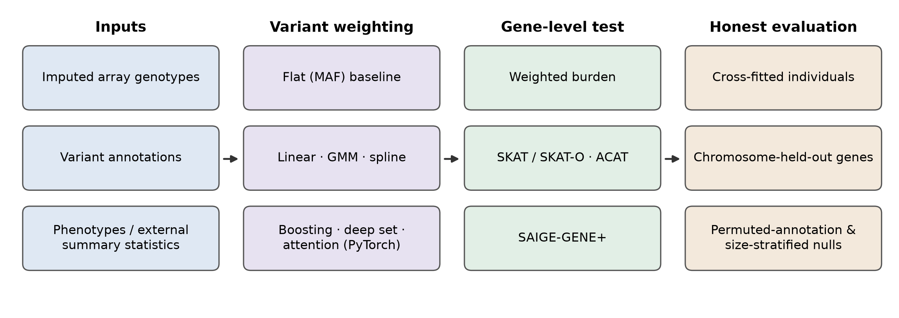

# Annotation-informed rare-variant gene-based modeling

Experimental framework for evaluating whether functional genomic annotations can improve
rare-variant aggregation and gene-based association models in an **array-genotyped,
imputed biobank** (noncoding variants, East Asian cohort).



## Research question

Can annotation-derived variant weights — learned with linear, nonlinear, mixture, spline or
neural-network models — make gene-based rare-variant tests more powerful than standard
frequency-weighted burden / SKAT / ACAT, **when the evaluation is protected against leakage
and evaluation artefacts**?

## What the repository contains

| Area | Folder | Main content |
|---|---|---|
| Data pipeline | `pipeline/annotation` | variant annotation joins (regulatory elements, TF peaks, conservation, sequence-model scores, fine-mapping priors) |
| | `pipeline/groupfiles_variants` | gene-window definitions, variant masks, SAIGE-GENE+ group files |
| | `pipeline/phenotype_nullmodel` | phenotype construction, covariates, SAIGE null models |
| Weighting models | `experiments/01_annotation_weighting_models` | flat vs weighted baselines, linear / GMM / spline / neural-network weight functions, supervised (fine-mapping PIP, phenotype) and cross-fitted variants |
| Association | `experiments/02_association_and_finemapping` | SAIGE-GENE+ runs, conditional analysis, in-cohort fine-mapping |
| Null evaluation | `experiments/03_audits_and_null_evaluation` | permutation nulls, calibration checks, run audits, identifiability (LD) measurements |
| Feasibility gates | `experiments/04_context_feasibility_gates` | pre-registered gates for context-dependent regulatory effects |
| Learned variant sets | `experiments/05_learned_regulatory_sets` | annotation-space clustering into regulatory modules, stability, LD / frequency confound checks, module-level gating |
| Haplotype context | `experiments/06_haplotype_context` | phased local-haplotype representations, unit-tested decision logic |
| Variant interactions | `experiments/07_attention_based_variant_interactions` | external PRS-CS and linear baselines; deep-set, attention and same-haplotype attention residual learners; GPU benchmarking and gradient checkpointing |
| Learning-value gate | `experiments/08_height_learning_value_gate` | annotation prediction of within-gene effects; chromosome split experiments, LD grouping and permutation feasibility gates |
| Utilities | `utils/reusable` | shared helpers |

The snapshot contains hundreds of Python, R and shell scripts. Successive versions
(`_v2`, `_v3`, …) preserve changes in experimental design; earlier versions use different
splits and controls and should be read with their corresponding analysis settings.

Research progression: **01 scalar weights → 05 learned regulatory modules →
06 haplotype context → 07 attention-based variant interactions**.

## Evaluation designs represented in the snapshot

- Cross-fitting across individuals and chromosome-held-out evaluations.
- Gene-level and chromosome-level split comparisons; their conclusions differ.
- Permuted-annotation, phenotype-permutation and group-size controls in selected arms.
- Pre-specified gates alongside explicitly exploratory or amended analyses.
- Resource watchdogs, atomic outputs and completion markers for long jobs.

## Exploratory interaction-aware aggregation

Scalar annotation weights of increasing complexity (linear, mixture, spline, boosting,
deep set) did not consistently improve gene-based tests, suggesting that the limiting
assumption may be the independent additive aggregation itself rather than the weight
function. After exploring learned regulatory modules (05) and haplotype context (06),
we tested the hypothesis that noncoding regulatory variants act in combination
(e.g. enhancer/repressor context) using PyTorch attention models in which variants
within a gene condition their contributions on each other. This included a phased
variant that restricts attention to variants on the same haplotype. Models were trained
as residual learners on top of PRS-CS and linear baselines and evaluated on held-out
individuals. **Attention models did not outperform the linear baseline under these
settings.** This biological hypothesis motivated the model; attention weights alone do
not establish enhancer/repressor mechanisms. The reported empirical outcome is a
research summary; cohort-derived result tables are excluded from this snapshot.

## Selected implementation highlights

- [`l1_train_v10.py`](experiments/01_annotation_weighting_models/model_v10_out/l1_train_v10.py):
  annotation-informed weighting with explicit evaluation and simulation settings.
- [`train_att_v6.py`](experiments/07_attention_based_variant_interactions/models/attention/train_att_v6.py):
  PyTorch transformer, mixed precision, gradient checkpointing and CUDA memory tracking.
- [`train_att_hei_res_v6.py`](experiments/07_attention_based_variant_interactions/models/attention/train_att_hei_res_v6.py):
  residual attention models, including the same-haplotype arm.
- [`final_phi_gate_v9.py`](experiments/08_height_learning_value_gate/final_phi_gate_v9.py):
  LD-grouped feasibility gates and within-gene permutation controls.
- [`haplotype tests`](experiments/06_haplotype_context/run_20260922T052403Z/code/tests):
  tests for local-haplotype decision logic and inference units.

## Key methodological lessons

1. **More complex models did not automatically outperform simple baselines.** Linear, mixture,
   spline, gradient-boosted and neural/attention weighting did not consistently beat
   frequency-weighted burden under pre-specified criteria.
2. **Results were sensitive to the genomic split design.** A model that looked predictive under
   gene-level cross-validation *within* a chromosome had no signal on a held-out chromosome
   (neighbouring genes share variants and LD).
3. **Group-size effects can create optimistic signals.** When LD-tagged variants are collapsed
   into groups and a group is summarised by the *maximum* of noisy member estimates, larger
   groups score higher by chance; annotations correlated with group size then look
   informative. Singleton-only analysis and size-stratified permutation removed the signal.
4. **Permutation-based nulls were essential** for separating model signal from evaluation
   artefacts.
5. In array + imputation data, rare noncoding variants are often not separable (they move
   together on haplotypes), which bounds what any variant-level weighting can learn.

## Data and configuration

Individual-level data and cohort-derived result tables are excluded. Input directories,
source-file names, source-column mappings, sample sizes and historical reference metrics
must be supplied through environment variables. Generic examples include
`PROJECT_ROOT`, `GENOTYPE_DIR`, `PHENO_DIR`, `GRM_FILE`, `N_SAMPLES` and
`EXPECTED_BASELINE_R2`. Python and R runtime paths resolve their environment variables;
missing required settings fail explicitly rather than silently using a cohort-size default.

See [CONFIGURATION.md](CONFIGURATION.md) for the settings inventory and source mapping
conventions. The scripts describe historical analyses and still require the relevant data,
external tools and per-analysis configuration. Syntax checks and small mock integrations
do not constitute an end-to-end run of the research analyses.

A documented synthetic-data demonstration and claims about simulation-based method
validation are reserved for v1.0.

## Environment and external dependencies

See `environment.yml`. Main tools include Python (numpy, scipy, pandas, scikit-learn,
PyTorch, cyvcf2, pysam), R, bcftools, PLINK 2 and SAIGE / SAIGE-GENE+.
Select the appropriate environment before running scripts; tools use `PATH` or explicit
binary settings. SAIGE container scripts require a configured runner and image.

**PRS-CS (Ge et al. 2019), installed from the official repository**, is an external
dependency. No PRS-CS implementation is bundled. Obtain it from
[the official PRS-CS repository](https://github.com/getian107/PRScs), follow its installation
instructions and set `PRS_CS_ROOT` to the checkout containing `PRScs.py`.
Citation: Ge et al., *Polygenic prediction via Bayesian regression and continuous
shrinkage priors*, Nature Communications 10, 1776 (2019),
[doi:10.1038/s41467-019-09718-5](https://doi.org/10.1038/s41467-019-09718-5).

The 07 folder is organized as follows; filenames preserve the recorded experiment versions:

```text
07_attention_based_variant_interactions/
├── baselines/prs_cs/
├── models/linear/
├── models/attention/
├── data_prep/
└── infra/
```

Each experiment's `FILES.md` lists the available scripts.

## Status

v0.1 — sanitized research code snapshot. A synthetic-data release with documented
end-to-end validation is planned for v1.0.
